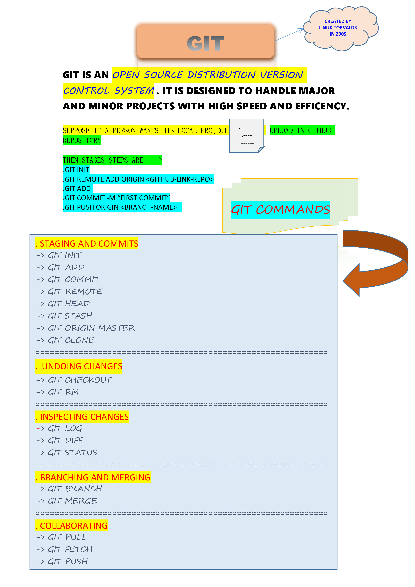

# GIT

As git commands mentioned in above image lets gets its decription of following commands : -> 

## Git Configuration

<ol>
<li><b>Git config</b> -> To get and set configuration</li>
<b>Set the name :</b>
<table>
 <tr><td>$ git config --global user.name "User name"</td></tr>
</table>
<b>Set the email :</b>
<table>
 <tr><td>$ git config --global user.email "example@gmail.com"</td></tr>
</table>
</ol>

## Staging and commits

<ol>
<li><b>Git init</b> -> creating and initialised local repository</li>
<table>
 <tr><td>$ git init</td></tr>
</table>
<li><b>Git ADD</b> -> Adding a file to staging area</li>
<table>
 <tr><td>$ git add filename</td></tr>
</table>
<table>
 <tr><td>$ git add .</td></tr>
</table>
<li><b>Git Commit</b> -> commits the file permanently in the version history with a message.</li>
<table>
 <tr><td>$ git commit -m "first message"</td></tr>
</table>
<li><b>Git Remote</b> -> Add remote for repository</li>
<table>
 <tr><td>$ git remote add </td></tr>
</table>
<li><b>Git Head</b> -> Head points out last commit in the current checkout branch.</li>
<table>
 <tr><td>$ git show HEAD</td></tr>
</table>
<li><b>Git Stash</b> -> The git stash command enables you to switch branches without committing the current branch.</li>
<table>
 <tr><td>$ git stash </td></tr>
</table>
<b>if we want to re-apply previous commits then we used :-></b>
<table>
 <tr><td>$ git stash pop</td></tr>
</table>
<li><b>Git Origin Master</b> -> Push or Pull data to remote server</li>
<table>
 <tr><td>$ git push origin master </td></tr>
</table>
<table>
 <tr><td>$ git pull origin master </td></tr>
</table>
<li><b>Git Clone</b> -> Make a local copy of server repository</li>
<table>
 <tr><td>$ git clone </td></tr>
</table>
</ol>

## Undoing changes
<ol>
<li><b>Git Checkout</b> -> This command is used to switch between branches in a repository.</li>
<table>
 <tr><td>$ git checkout branchname </td></tr>
</table>
<li><b>Git RM</b> -> rm stands for remove so it remove the files</li>
<table>
 <tr><td>$ git rm filename </td></tr>
</table>
</ol>

## Inspecting Changes
<ol>
<li><b>Git Log</b> -> Display the most recent commits and the status of the head</li>
<table>
 <tr><td>$ git log </td></tr>
</table>
<li><b>Git Diff</b> -> Track the changes that have not been staged</li>
<table>
 <tr><td>$ git diff </td></tr>
</table>
<li><b>Git Status</b> -> Display the status of the working directory and the staging area</li>
<table>
 <tr><td>$ git status </td></tr>
</table>
</ol>

## Branching and Merging
<ol>
<li><b>Git Branch</b> -> It creates the branch</li>
<table>
 <tr><td>$ git branch branchname </td></tr>
</table>
<li><b>Git Merge</b> -> Merges the branches</li>
<table>
 <tr><td>$ git merge </td></tr>
</table>
</ol>

## Collaborating
<ol>
<li><b>Git Pull</b> -> Pull the data from server and remote branch</li>
<table>
 <tr><td>$ git pull origin master </td></tr>
</table>
<table>
 <tr><td>$ git pull</td></tr>
</table>
<li><b>Git Fetch</b> -> fetch remote repository</li>
<table>
 <tr><td>$ git fetch </td></tr>
</table>
<li><b>Git Push</b> -> Transfer the commits from your local repository to a remote server</li>
<table>
 <tr><td>$ git push origin master </td></tr>
</table>
</ol>

