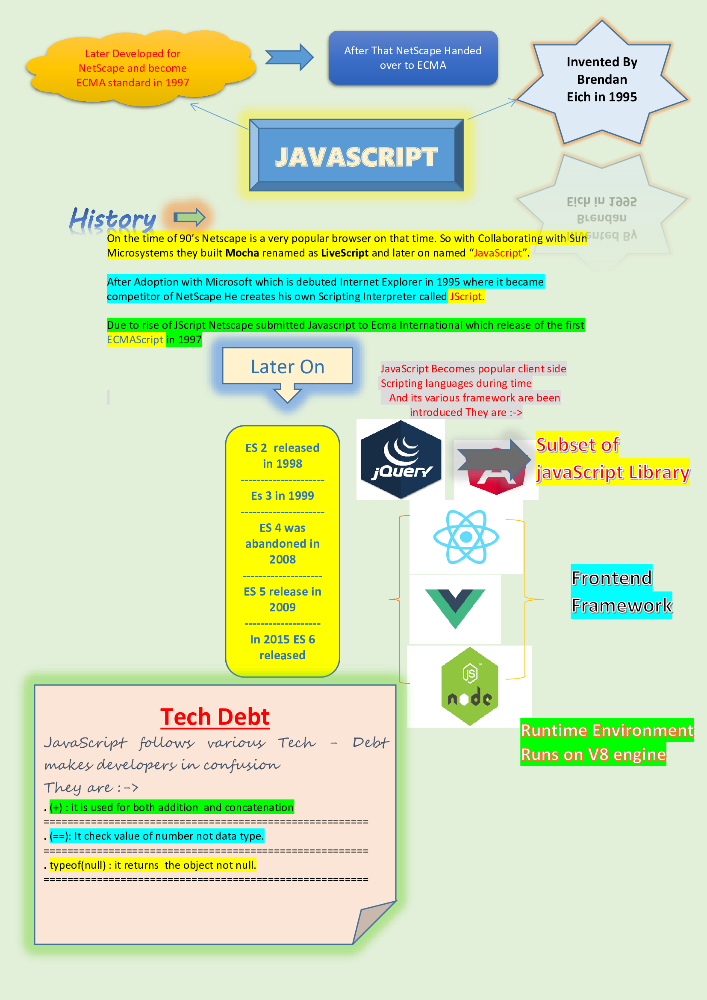
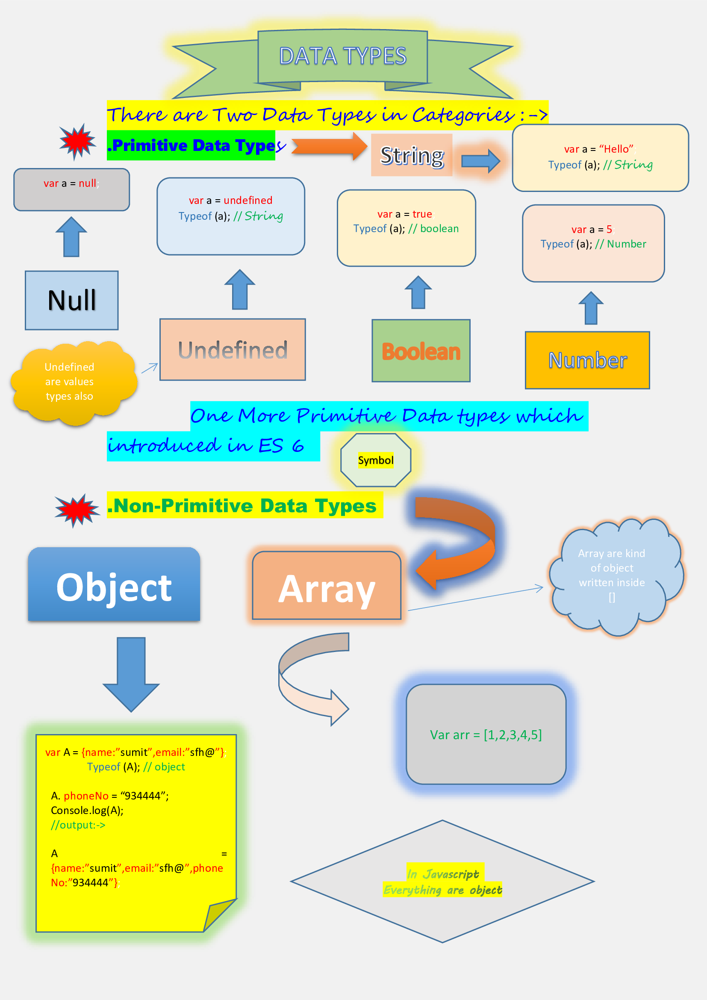
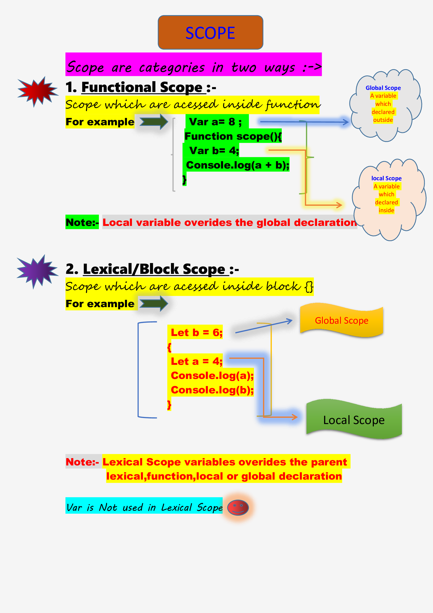
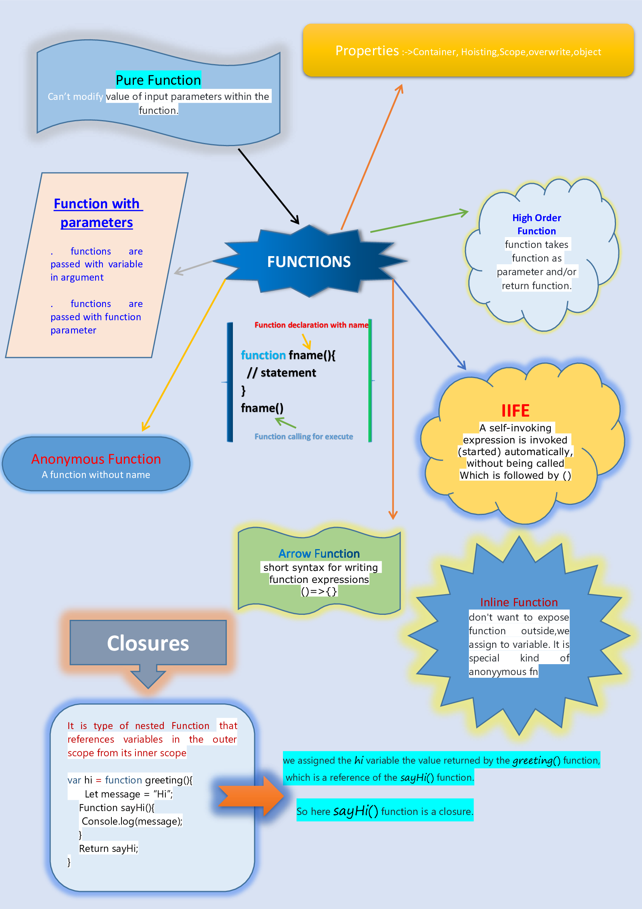
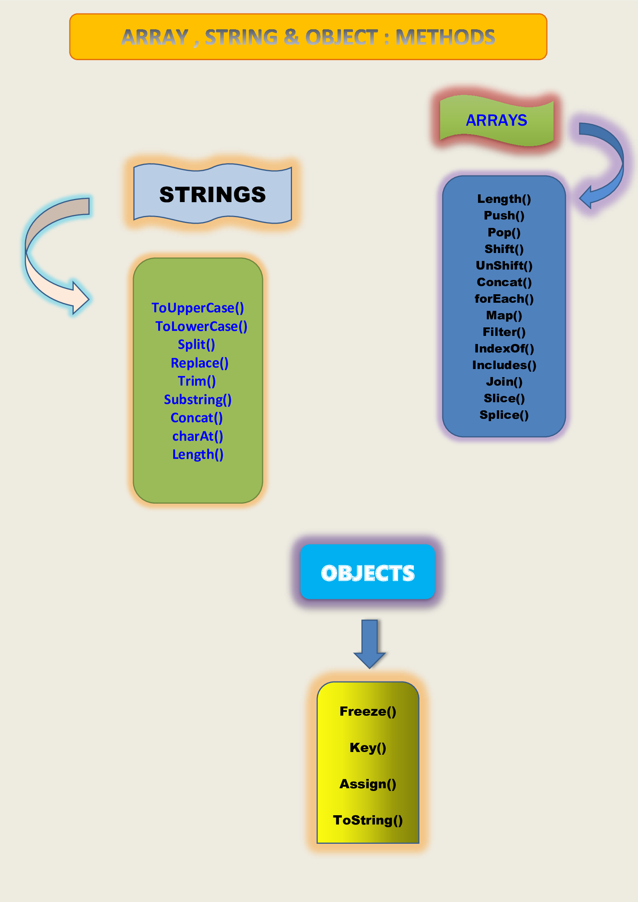

# JAVASCRIPT
## HISTORY OF JAVASCRIPT



## Fundamentals Of JavaScript

### Conditional Statements

<b><i>Conditional statements are used to perform different actions based on different conditions.</i></b>

### if/else

The `if` statement executed if a condition is true And The `else`statement executed if the condition is false.

Syntax :-
```js
if(condition){
  // code to be executed if condition is true.
} else {
  // code to be executed if the condition is false.
}
```
## Switch-Case

 The `switch` statement to select one of case code blocks to be executed.

Syntax :-
```js
switch(expression){
case 1 :
  // some code
  break;
case 2 :
  // some code
  break;
default:
  // code block  
}
```

## Loop Statement

### While Loop

The `while` loop will loop through a block of code as long as specified condition is true.

Syntax :-
```js
while(condition){
  // condition to be executed
  // Then increment/decrement statement
}
```
### Do-while

The `do-while` loop will execute code block once, before checking if the condition is true, then it will repeat the loop as long as the condition is true.

Syntax :-
```js
do {
  // code block to be executed
  // Then increment/decrement statement
}
while(condition);
```
### For

The `for` loop will loop through a block of code a number of times.

Syntax :-
```js
for(initialization, condition, increment/decrement){
  // code block
}
```
## Operators

<b><i>An operator performs some operation on single or multiple operands (data value) and produces a result.</i></b>

<i>There are different types of Operators :-></i>

### ARITHMETIC OPERATOR
|Operator|Description|Syntax|
|---------|----------|--------------|
|+|Additon| a+b|
|-|Substraction|a - b|
|* |Multiplaction|a * b|
|/ |Division | a/b|
| %| Modulus gives remainder as output| a% b |
|==|check value type of equality|a == b|
|===|check both value and reference type of equality|a === b|
|!=|Not Equal| a != b|
|>|Greater than|a > b|
|<|Less than|a < b|
|>=|Greater than equal|a >= b|
|<=|Less than equal|a <= b|

###  LOGICAL OPERATOR
<table>
        <tr>
                <th>Operator</th>
                <th>Description</th>
                <th>Syntax</th>
        </tr>
          <tr>
                <td>&&</td>
                <td>AND</td>
                <td>(a && b)</td>
        </tr>
          <tr>
                <td>||</td>
                <td>OR</td>
                <td>(a || b)</td>
        </tr>
          <tr>
                <td>!</td>
                <td>NOT</td>
                <td>!(a)</td>
        </tr>
</table>

### CONDITIONAL OPERATOR
|Operator|Description|Syntax|
|---------|----------|--------|
|? : |Ternary Operator|a?b:c|

## Variables

<i>Javascript are dynamic programing language and so as Js variables are containers which stored data</i>

<b>Variables are described in there ways :-></b>

|Var|Let|Const|
|---|---|----|
|Can be redeclared|Not been redeclared|Declared and initialised at once not redeclared|
|Can be reInitialised|Can be reInitialised|Not reInitialised|
|Functional Scope|Lexical Scope|Lexical Scope|
|Introduced in ES 5|Introduced in ES 6|Introduced in ES 6|
|Can be Hoisted|Not Hoisted|Not Hoisted|
### Syntax :->
#### Var
``` Js
var a = 10;
var b = "myName";
```
#### Let
``` Js
let a = 5; 
a = 6; // reassign possible
let a = 6; //Now redeclaration is not possible so Error will come
```
#### Const
``` Js
const val= 5; 
val = "JavaScript"; //reassign not possible 
const val = 6; //redeclaration not possible 
```
## DataTypes



<b>Note :-></b> {0,Null,NaN,"",undefined} are `falsy` values other than value are considered to be `Turthy` values.

## Scope

<b>Before knowing about Scope let first dicuss What is Hoisting ?</b>

## Hoisting
<p style="color:red;">Hoisting is JavaScript default behavior of declaration moving to top</p>

<b>Lets Understand by Example :-></b>

```Js
x = 5;
console.log(x); //output :- 5
var x;
```
<i>Why output comes 5 because {a variable can be used before it has been declared} means var variables moves to top and becomes -></i>

```Js
var x; // This default behavior moves to top known as Hoisting
x = 5;
console.log(x); //output :- 5
var x;
```
<p style="background-color: lightblue;"><b>Scope determines the accessibility means visibility of variables.</b></p>

<b>In given below images lets understands about scope</b>



## COPY BY VALUE AND COPY BY REFERENCE

1. <b>Copy By Value</b>
<p style="color:blue;">Here values stored in initialized variable.All Primitive Data Types are used in Copy By Value.</p>

### Code Examples :-
```JS
var a = 13         // assign `13` to `a`
var b = a          // copy the value of `a` to `b`
b = 37             // assign `37` to `b`
console.log(a)     // o/p => 13
```
<i>The original was not changed, we can only change the copy.<i>

2. <b>Copy By Reference</b>
<p style="color:cyan;">A reference type can contain other values and it store or you say point in the memory location by initialize variable.All Non-Primitive Data Types are used in Copy By Reference</p>

### Code Examples :-
```Js
var a = { c: 13 }  // assign the reference of a new object to `a`
var b = a          // copy the reference of the object inside `a` to new variable `b`
b.c = 37           // modify the contents of the object `b` refers to `a`
console.log(a)     // => { c: 37 }
```
<i>The original was also changed, since the reference got copied.</i>

## JavaScript Function
<b style="color:red">Function are most beautiful thing javascript It is used for <i>Reuseability</i></b>
It is a block of code designed to perform a particular task and executed when calls it.

 
<i>Let us dicuss topics inside functions are defined in above image<i>

### Properties of Function
* Container - It is act or calls as container
* Hoisted - Can call a function before you define a function. 
* Scope - local & global
* Object - function can also be a object 
* Override - It overwrites the re-define function

<b>Function are called as <i>First-class-citizen</i></b>
As :->

* Function can assigned to variable
* can return from another function
* Function return function
### Function with parameters

```Js
// Function are passed with variable in argument
var sport = "chess";
function printSport(abc){
  abc = "cricket";
  console.log(abc);
}
printSport(sport);//o/p will 'cricket' because primitive type are copy by value
=========================================================================
// Function are passed with function in argument
function greet(){
  return "Hi";
} 
function main(body){
  let inside;
  if(body && (typeof body === "function") && body()){// always do type-check for safe guard
       inside = body;//inside is pointing to greet function
      }else{
        inside = function(){

        }
      }
}
main(greet);//function passed as parameter
```
<b>Good Pratice</b> : If function is passed as parameter always do type-check function and also create empty function incase if function is not passed as parameter.

### Anonymous Function
```Js
function () { // assigned as without Function name
    console.log('Anonymous function');
};
```
### High order Function and Pure Function
```Js
// Note :-> For pure function {If we want to perform operation on input parameter the copy them into other variable and the use this variable instead.}
var price = 25;
function fruits(){// HGH returns function
  var apple = function(cash){// pure function assiged to variable
    return cash;
  }
  return apple;// function returns function so that it accesed from outside
}
var fruit = fruits(); //function assigned to variable
var check = fruit(price); // passed argument to accesed inside function
console.log(check);// o/p 25
```
### IIFE(Immediately Invoked Function Expression)
```Js
var outside = (function(userId){ // IIFE also called as Self-executing function expression(SEF)
  console.log("inside");
  function hello(value,userId){
    console.log(value,userId);// userId is avaiable in IIFE due to closure
  }
  return hello;
})(30);

outside(10);// passed to access hello function
```
### Inline Function
```Js
var a = function (){
  // statement
}
// some more ex:->
(function(userId){ // IIFE also called as Self-executing function expression(SEF)
  console.log(userId);
})(function(){    //Inline function
  return 2;
});
```
### Arrow Function 
```Js
var a = () => {
  console.log("Hello");
}
```

## JavaScript Constructor & Prototype
<b>In JavaScript We Known almost everything is Objects</b>
<p style="color:red">Objects are written in {Key:Value} Pairs</p>
For Example :-

```Js
let person = {name:"sam",age:"30"};
```
<b><i>JavaScript Objects are containers for named values, called properties and methods.</i></b>

### Creating a JavaScript Objects 
. using an object literal.
. Create a single object, with the keyword <b>new.</b>
. Creating with Function Constructor & prototype    
. Create an object using Object.create().

<b>Lets dicuss with given Example :-></b>

```Js
var person = {firstName:"sam",lastName:"whitefield",age:"30"}; // This is easiest ways to create object we mostly used object literals because it gives readability, simplicity and execution speed,
=========================================================================
var person = new Object();
person.firstName = "sam";
person.lastName = "whitefield";
person.age = "31";
/*Creating the objects with new keyword but we not used mostly at a time */
=========================================================================
/* Constructor is the pointer to the function that create objects */
function Person(first,last,age){
  this.firstName = first;
  this.lastName = last;
  this.age = age;
}
var student = new Person("John","Doe",25) // create a person object
/* Prototype is used to add a new property to the constructor function */
Person.prototype.email = "john@gmail.com";
Person.prototype.getName = function(){
  return this.firstName+" "+this.lastName;
}
/* We can also inheritance prototype property in javascript */
// For ex :->
function Person(first,last){
  this.firstName = first;
  this.lastName = last;

function Student(email) { 
  this.email = email;  
}
Student.prototype._proto_ = new Person("sam","deo");// Now Student inherited property of person
=========================================================================
var person = {name:"john",age:31}
var person1 = Object.create(person); // using Object.create() but we not really used.
```
#### In above Example we have used `this` Keyword in function so lets now discuss behaviour in different context.

<b style="color:blue">In function `this` refers to itself but In ES5 if method is directly attached to object key then this refer to current object if not this refer to global object.
In ES6 in arrow function this keyword holds the scope of it's nearest parent.</b>

#### For Examples :-

```Js
var person = {
    first Name:"John",                    
    lastName:"Doe", 
    getdetail: function(){ /
        return this;  // refers to current object
    }, 
    getdetail2: function(){   
      return function(){      
        return this;
      };  // refers to global object
    },
    getdetail3: function() { // this => student object
      return () => {   
        return this; // refers to current object 
      };  
```
### Built - In Methods :-
|Built-In Constuctor|Description|
|-------------------|-----------|
|String|{var str = new string()} -> basically not used with new keyword we used directly with literals {var str = "Hello"}|
|Number|Var num = new Number()|
|Boolean|{var bol = new Boolean()} can not used with new same as string directly used as {var bol = true;}|
|Array|{var arr = new Array()} also used directly {var arr = [];}|
|RegularExpression|{var exp = new RregExp()}|
|Date|{var date = new Date()} creating new date object|
|Math|Don't use with new keyword,It can be acessed using some predefined methods like (Math.floor(),Math.ciel())|

## Arrays,Strings and objects Methods :-

<b><i>As In above figure we introduced various methods of arrays,string and object Now lets discuss with Example :-></i></b>

```Js
                   // Arrays Methods
var fruits = ["Banana","Orange","Mango"];
fruits[fruits.length] = "Apple";//Length property provides easiest ways to append a new element at array
fruits.pop(); // removes the last element
fruits.push("Apple");// adds a new element at last end
fruits.shift();// remove begining of array element
fruits.unshift("Kiwi"); // adds a new element in begining of array 

/* The Concat() concatenates two arrays and return new array */
var fruits = ["Banana","Orange","Mango"];
var vegetables = ["Potato","LadyFinger"];
var meal = fruits.concat(vegetables);

fruits.slice(1);// it returns a new array by slicing out parameter of element to be removed It does not effect source existing array

fruits.splice(1,1,"Kiwi"); // adds/remove or you may say overwrites the array first parameter takes position to add and second how many elements to remove

fruits.join(" ");// returns returns an array as a string.
fruits.indexOf("Apple"); // returns index of element
fruits.includes("Banana"); // check whether element is present or not and returns true/false

/* filter() takes function as parameter to pass the test and it does not effect to existing array */
var ages = [32, 33, 16, 40];
ages.filter(checkAdult)    // Returns [32, 33, 40]
function checkAdult(age) {
  return age >= 18;
}

/* Foreach() used for iteration and calls a function as parameters for each element in a array */
fruits.forEach(function(item, index) {
  console.log(item, index);
});

/* Map() creates a new array with the results of calling a function for every array element. */
const numbers = [65, 44, 12, 4];
numbers.map(function myFunction(num) {
  return num * 10;
});
=========================================================================
                       //Strings Methods
let str = "Hello Grind!";
str.toUpperCase(); // returns string to uppercase
str.toLowerCase(); // returns string to lowercase
str.split(" "); // returns splits a string into array
str.replace("Hello","missingskill"); // replaces element of strings
str.trim(); // removes the whitespace both ends
str.substring(1,4);// extracts the characters and returns new strings
str.charAt(0);// returns the character at a specified index in a string
str.length; // returns the length of string
=========================================================================
                      //Objects Methods
var student = {
  first Name:"John",                    
  lastName :"Doe", 
   rollNo:50,
   subjects : ["Science", "English"]
}
Object.keys(student);//returns keys of object in array form
Object.assign({rollNo:27},student)// Objects are assigned and copied by reference.
Object.freeze(student); // It freeze the object so that nobody can modify the properties
student.toString(); // returns objects to string
```
## Built-In Functions and ES6

### SetTimeout()
<b><i>It is used to delay code by given time.</i></b>
For ex ->

```Js
setTimeout(function(){
   alert("Hello"); 
}, 3000);
```
### SetInterval()
<b><i>It will execute in continous loop..</i></b>
For ex->

```Js
setInterval(function(){
console.log("Printing after 2 seconds");
},2000);// it will loop at every 2 second
```
<i style="color:cyan">To solve the problem of continuation of loop we  used method named as clearInterval</i>

```Js
let count = 0;
const timer = setInterval(function(){
console.log("Printing after 5 seconds");
if(counter > 5){
clearInterval(timer);
}
count++;
},3000);
```
### parseInt()/parseFloat()
<b>This methods is used to parses string to number/float and NaN</b>

```Js
parseInt('fy45'); //NaN
parseInt('78.6'); //78

parseFloat("256.56ads"); //256.56
parseFloat("gh33"); //NaN
```
### JSON {JavaScript Object Notation}
<b>JSON is often used to send data over the network. JSON format is same as object the only difference it used "" like {"Key":"Value"}.</b>
<b><i>It is used in any Languages</i></b>

```Js
var student = {
  first Name:"John",                    
  lastName :"Doe", 
   rollNo:50
}
var J = JSON.stringify(student);// returns in JSON Format
JSON.parse(J); // returns JSON Into object
```
### Template Literals
<b><i>Template literals are string literals allowing embedded expressions using {`${}`}<i></b>
For Ex->

```JS
var firstName = "John";
var lastName = "Doe";
console.log(`${firstName} ${lastName}`);
```
### Destructuring
<b>It is used to assign elements of array/object into variable</b>

```Js
// Array destructuring
var name = ["sam", "mike", "doe"];

var [first, second, third] = name;

// Object destructuring
var user = {
  id = 1,
  name = "Mike",
}

var {id,name} = user;
```
### Spread Operator
<b>It is used with three dots(...) which targets the entire values in the particular variable</b>

```Js
let colors = ['Red', 'Yellow'];  
let newColors = [...colors, 'Violet', 'Orange', 'Green'];  
console.log(newColors);  
```
### Rest Operator
<b>It is also same as Spread operator that can be used in destructuring</b>

```Js
var colors = ["Violet", "Indigo", "Blue", "Green", "Yellow", "Orange", "Red"];    
    
// destructuring assignment    
var [a,b,...args] = colors;  
```


