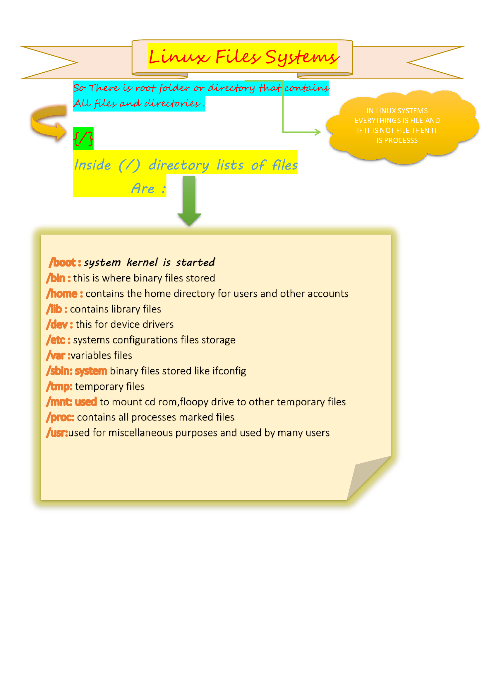

# LINUX

## Linux History & Commands

<i>Lets dicuss commands in following descriptions :-> <i>

<ol>
<li><b>ls command</b> :-> use for listing the files</li>
<table>
 <tr><th>Sr No</th>
<th>Command :-></th>
 <th>Syntax :-></th>
 <th>Used For :-></th>
</tr>
<tr><td>1</td>
<td>ls -l</td>
 <td>$ ls -l</td>
 <td>It is used to show the list of folder or files with their permission</td>
</tr>
<tr><td>2</td>
<td>ls -h</td>
 <td>$ ls -l -h</td>
 <td>It converts some of details which is non human readable</td>
</tr>
<tr><td>3</td>
<td>ls -t</td>
 <td>$ ls -l -h -t</td>
 <td>It shows the files which created first at top of list</td>
</tr>
<tr><td>4</td>
<td>ls -t</td>
 <td>$ ls -l -h -t -r</td>
 <td>It same as ls -t only it shows in reverse meaning bottom of list</td>
</tr>
<tr><td>4</td>
<td>ls -a</td>
 <td>$ ls -a</td>
 <td>It is used to show the hidden files</td>
</tr>
</table>
<li><b>cd command</b> :-> use for change the directories</li>
<table>
<tr><th>Sr No</th>
<th>Command :-></th>
 <th>Syntax :-></th>
 <th>Used For :-></th>
</tr>
<tr><td>1</td>
<td>cd</td>
 <td>$ cd filename/directoryname</td>
 <td>changes its file and directory name as specified with command</td>
</tr>
<tr><td>2</td>
<td>cd -</td>
 <td>$ cd -</td>
 <td>It jump to the user home directory</td>
</tr>
<tr><td>3</td>
<td>cd ..</td>
 <td>$ cd..</td>
 <td>jumps on previous directory</td>
</tr>
</table>
<li><b>cp command</b> :-> copies one files to another</li>
<table>

Syntax :

<tr><td>$ cp filename1 filename2</td></tr>
</table>
<li><b>mv command</b> :-> move one files to another</li>
<table>

Syntax :

<tr><td>$ mv filename1 filename2</td></tr>
</table>
<li><b>rm command</b> :-> stands for remove means it delete the file</li>
<table>
 <tr><th>Sr No</th>
<th>Command :-></th>
 <th>Syntax :-></th>
 <th>Used For :-></th>
</tr>
<tr><td>1</td>
<td>rm</td>
 <td>$ rm filename</td>
 <td>It is used to remove specific file</td>
</tr>
<tr><td>2</td>
<td>rm -rf</td>
 <td>$ rm -rf directoryName</td>
 <td>It is used to remove directory name including within file</td>
</tr>
<tr><td>3</td>
<td>rm -rf *</td>
 <td>$ rm -rf *</td>
 <td>It is used to remove multiple directory name inculding within file</td>
</tr>
</table>
<li><b>pwd command</b> :-> it stands for present working directoty</li>
<table>

Syntax :

<tr><td>$ pwd</td></tr>
</table>
<li><b>who command</b> :-> checks current logged user in system</li>
<table>

Syntax :

<tr><td>$ who</td></tr>
</table>
<li><b>whoami command</b> :-> prints current logged username</li>
<table>

Syntax :

<tr><td>$ whoami</td></tr>
</table>
<li><b>History command</b> :-> Tells list of commands used earlier</li>
<table>

Syntax :

<tr><td>$ history</td></tr>
</table>
<li><b>Exit command</b> :-> leaves the terminal</li>
<table>

Syntax :

<tr><td>$ exit</td></tr>
</table>
<li><b>who command</b> :-> checks current logged user in system</li>
<table>

Syntax :

<tr><td>$ who</td></tr>
</table>
<li><b>Cat command</b> :-> used for create,view and concatenate files</li>
<table>
<tr><th>Sr No</th>
<th>Command :-></th>
 <th>Syntax :-></th>
 <th>Used For :-></th>
</tr>
<tr><td>1</td>
<td>cat</td>
 <td>$ cat filename</td>
 <td>It is used to show the content of file</td>
</tr>
<tr><td>2</td>
<td>cat >></td>
 <td>$ cat >> filename</td>
 <td>It is used to modify the content of file</td>
</tr>
<tr><td>3</td>
<td>ls ></td>
 <td>$ ls > filename</td>
 <td>It is used to overwrite the content of file</td>
</tr>
</table>
<li><b>less command</b> :-> same as cat but shows large content of file</li>
<table>

Syntax :

<tr><td>$ less filename</td></tr>
</table>
<li><b>more command</b> :-> shows fixed content text view of file</li>
<table>

Syntax :

<tr><td>$ more filename</td></tr>
</table>
<li><b>Echo command</b> :-> Prints output of message</li>
<table>

Syntax :

<tr><td>$ echo message</td></tr>
</table>
<li><b>Top command</b> :-> Shows list of system processes</li>
<table>

Syntax :

<tr><td>$ top</td></tr>
</table>
<li><b>Ps command</b> :-> Shows all the running application of system</li>
<table>

Syntax :

<tr><td>$ ps -ef</td></tr>
</table>
<li><b>Touch command</b> :-> It creates the file</li>
<table>

Syntax :

<tr><td>$ touch filename</td></tr>
</table>
<li><b>Ping command</b> :-> its checks the connectivity outside the world</li>
<table>

Syntax :

<tr><td>$ ping websitename</td></tr>
</table>
<li><b>ifconfig command</b> :-> Gives configurations of your system</li>
<table>

Syntax :

<tr><td>$ ifconfig</td></tr>
</table>
<li><b>ssh command</b> :-> Its start communication b/w two hosts and share the data with eachother</li>
<table>

Syntax :

<tr><td>$ ssh </td></tr>
</table>
<li><b>which command</b> :-> It Locates the path of any command</li>
<table>

Syntax :

<tr><td>$ which commandname</td></tr>
</table>
<li><b>WGET command</b> :-> It used to get IpAddress of site in your system</li>
<table>

Syntax :

<tr><td>$ wget url</td></tr>
</table>
<li><b>help command</b> :-> as its name it helps you to find information which you need</li>
<table>

Syntax :

<tr><td>$ help</td></tr>
</table>
<li><b>Mkdir command</b> :-> It creates the directory</li>
<table>

Syntax :

<tr><td>$ mkdir directoryName</td></tr>
</table>
<li><b>Rmdir command</b> :-> It will remove the directory</li>
<table>

Syntax :

<tr><td>$ rmdir directoryName</td></tr>
</table>
<li><b>clear command</b> :-> used to clear the screen</li>
<table>

Syntax :

<tr><td>$ clear</td></tr>
</table>
<li><b>Man command</b> :-> Gives specific information of command</li>
<table>

Syntax :

<tr><td>$ man commandName</td></tr>
</table>
</ol>

## FILE SYSTEM AND DIRECTORIES

<i>Files System and directory described in below image </i>

